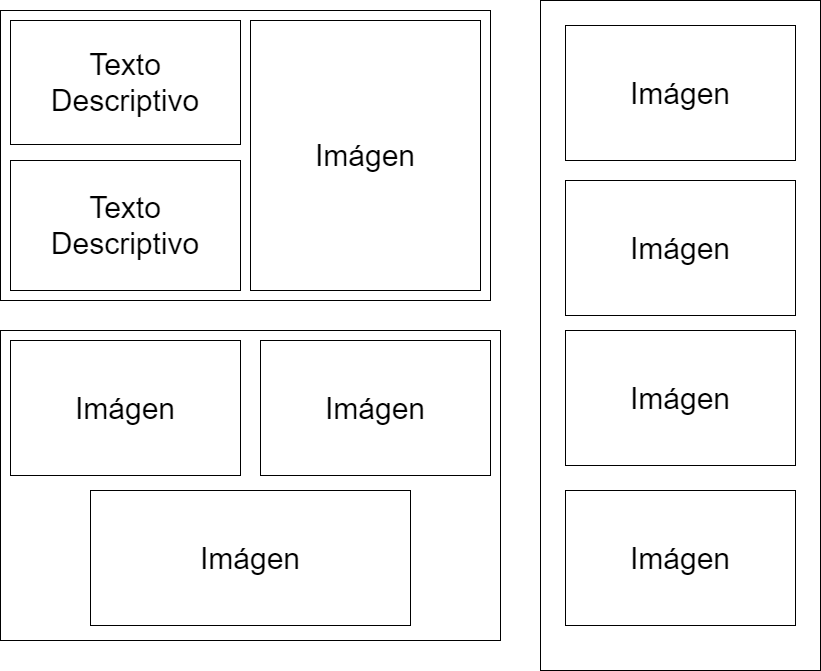

# Numero 9 Page

Esta pagina ha sido realizada por Yeison González Rascado, alumno de 1º de DAW

↓ Links de todas las versiones ↓

## [Versión 0](../Numero-9-Page/Version%200/index.html)
+ Esta version es el archivo html básico, sin ningun estilo añadido.
## [Versión 1](../Numero-9-Page/Version%201/index.html)
+ Versión usando CSS y CSS3, con una amplia variedad de propiedades y mi estilo personal.
## [Versión 2](../Numero-9-Page/Version%202/public_html/index.html)
+ Version de la página original mezclada con un estilo y plantilla extraida de la comunidad.

Despliegue Web ➜ [Aquí](https://yeisongonz.github.io/Numero-9-Page/)

---

## Documentación 📖

### Version 1

#### ↓ Lista de 25 etiquetas CSS usadas ↓

1. font-family
2. font-size
3. background-color
4. background-image
5. background-position
6. background-size
7. height
8. width
9. display
10. justify-content
11. color
12. list-style
13. margin-bottom
14. text-align
15. border-radius
16. position
17. top
18. text-shadow
19. text-decoration
20. flex-wrap
21. margin-top
22. margin
23. align-items
24. flex-direction
25. grid-template-columns

#### Display Flex en mi Web

Aquí dejo un pequeño esquema explicativo de como estan dispuestas las imagenes.



#### ¿Como use grid layout?

En la página use grid para la sección de los personajes.

Se usa un grid de 5 elementos.

```css
.characters{
    margin-top: 2em ;
    margin-left: 3em;
    display: grid;

    grid-template-columns: 2fr 2fr 2fr;
    grid-gap: 20px;
}
```
