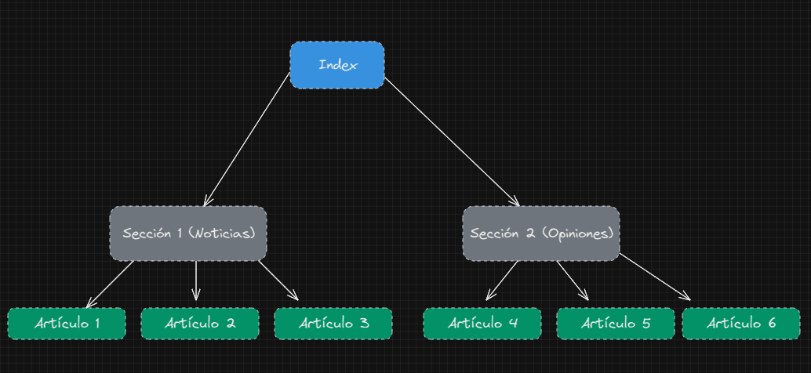

# Canal RSS

### Estructura:

Estructura del contenido HTML.

Todos obtienen el estilo de un css común. **css/style.css**

### Etiquetas complementarias RSS

Aqui todas las explicaciones de las etiquetas rss adicionales usadas.

#### managingEditor

> El elemento managingEditor incluye la dirección de correo electrónico de la persona responsable de los contenidos del canal.

#### copyright

> El elemento copyright contiene datos sobre los derechos de autor del canal.

#### pubDate

> El elemento pubDate determina cuándo se ha de publicar el artículo correspondiente.

#### webMaster

> El elemento webMaster integra el correo electrónico de la persona encargada de solucionar los problemas técnicos del canal. En el ejemplo actual, esto no tiene lugar en el sentido de la especificación.
